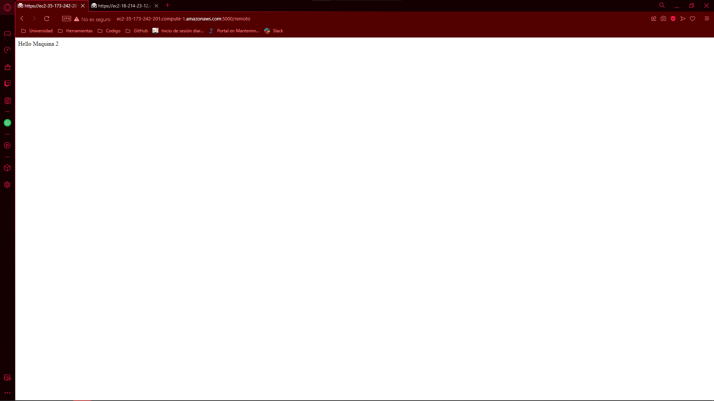
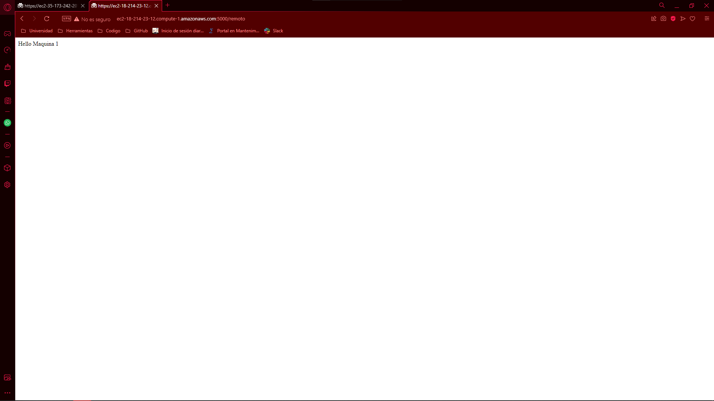

# AREP Taller 7

Aplicativo que hace una conexión segura mediante ssl, comprobando que el certificado que se le esté pasando este guardado en los certificados confiables

## Iniciando

### Prerequisites

- Maven - Administrador de dependencias y administrador del ciclo de vida del proyecto
- Java - Ambiente de desarrollo
- Git - Sistema de control de versiones y descarga del repositorio

### Descripción de la arquitectura

Tenemos un browser que puede hacer la consulta de los recursos en dos instancias diferentes de EC2, cada instancia tiene dos recursos los cuales hacen referencia a un recurso local y otro recurso el cual hace una petición a la máquina contraria mediante un método seguro

### Instalando el entorno

Se puede ingresar al siguiente video para verificar el funcionamiento de las máquinas
https://youtu.be/yFCNb9cXt5w

## Documentación
Se encuentra la documentación en la carpeta nombrada "javadoc", para generar nueva documentación puede correr el siguiente comando
```
mvn javadoc:javadoc
```
La nueva documentación generada puede encontrarla en la ruta /target/site/apidocs

## Comprobración del aplicativo mediante test de usuario

En esta primera imagen vemos la consulta al recurso local de la maquina 1


Aquí podemos ver la consulta al recurso local de la máquina 2


Luego hacemos la consulta al remoto de la máquina 1 y como resultado nos da el local de la máquina 2


Luego hacemos la consulta al remoto de la máquina 2 y como resultado nos da el local de la máquina 1


## Construido con

* [Maven](https://maven.apache.org/) - Dependency Management

## Versonamiento

Versión 1.0

## Autores

* Daniel Esteban Ramos Jimenéz